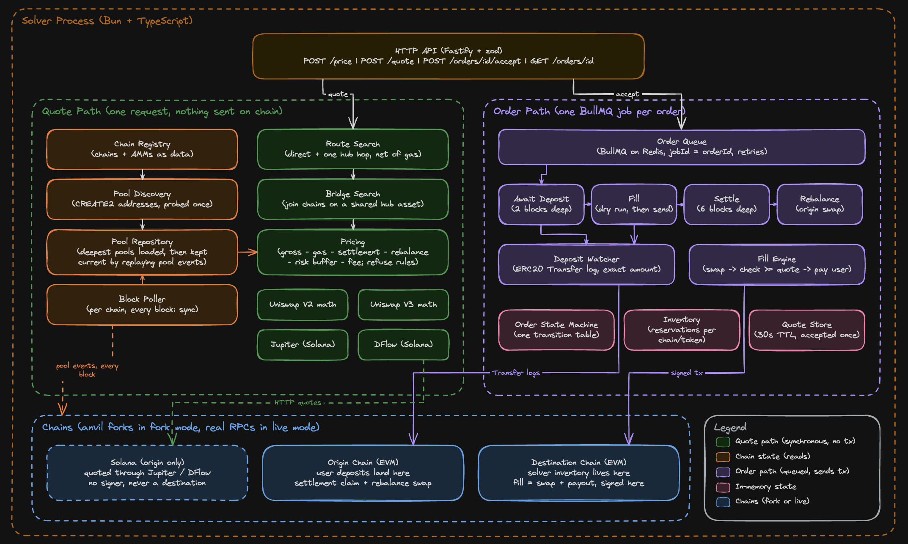

# Solver Engine

A cross-chain fill-then-settle solver. Given an intent such as selling 1 WETH on Arbitrum for USDC
on Base, it prices the trade against real pool state on both chains, waits for the user's deposit,
pays the user with a signed transaction, and settles once the deposit is final.

- Pool addresses are derived with CREATE2 and read from mainnet, never from a subgraph or a list.
- Output amounts come from our own Uniswap V2 and V3 implementations, which match QuoterV2 to the wei.
- Gas is a transaction receipt on a fork or `estimateGas` on the live chain, never an estimate of our own.
- Fills, refunds and rebalances are signed transactions, on anvil forks of the chains or on the chains themselves.



## What a solver is

A solver is a market maker that buys a user's deposit at a discount. The user sends 10,000 USDC on
Base, the solver pays them ETH on Arbitrum out of its own inventory, and collects the 10,000 USDC
afterwards. The spread is its revenue, earned by fronting capital and taking the risk of not being
repaid. Relay, Across and deBridge work this way. CoW and UniswapX do not, since there the fill and
the payment are one atomic transaction.

## Example run

1 WETH into USDC on Base against an anvil fork at block 51167991. The user was quoted
2450.117708 USDC, deposited, and received exactly that amount in transaction `0xef88…d0bc`. The
swap produced 2454.539844 USDC, so the solver kept 4.42 USDC.

<details>
<summary><code>POST /quote</code></summary>

```json
{
  "orderId": "6e98f3dd-205f-4c39-b553-d6dc66a90df1",
  "quote": {
    "amountOut": "2450117708",
    "expectedProfit": "4418170",
    "expiresAtMs": 1789125924432,
    "fees": {
      "relayerGas": "3966",
      "relayerService": "1963631",
      "app": "0",
      "settlement": "0",
      "rebalance": "0",
      "riskBuffer": "2454539"
    },
    "route": {
      "hops": 1,
      "grossAmountOut": "2454539844",
      "gasUsed": "268866",
      "legs": [
        {
          "sourceId": "concentrated-liquidity",
          "poolId": "0x72AB388E2E2F6FaceF59E3C3FA2C4E29011c2D38",
          "tokenIn": "0x4200000000000000000000000000000000000006",
          "tokenOut": "0x833589fcd6edb6e08f4c7c32d4f71b54bda02913",
          "amountOut": "2454539844",
          "latencyMs": 2.286
        }
      ]
    }
  }
}
```

</details>

<details>
<summary><code>POST /orders/6e98f3dd-205f-4c39-b553-d6dc66a90df1/accept</code></summary>

```json
{
  "deposit": {
    "chainId": 8453,
    "token": "0x4200000000000000000000000000000000000006",
    "amount": "1000000000000000000",
    "to": "0xf39Fd6e51aad88F6F4ce6aB8827279cffFb92266"
  },
  "jobId": "6e98f3dd-205f-4c39-b553-d6dc66a90df1",
  "order": { "state": "AWAITING_DEPOSIT", "status": "waiting" }
}
```

</details>

<details>
<summary><code>GET /orders/6e98f3dd-205f-4c39-b553-d6dc66a90df1</code></summary>

```json
{
  "status": "success",
  "state": "SETTLED",
  "failReason": null,
  "failDetail": null,
  "depositTx": "0xc8ce13560a22a469249222b3dfb1d7989d834b5b858c3ed95ea4b70c7acc1df1",
  "fillTx": "0xef8841cd7e29d44a587406edb1c72112ceb670a005a4f5fce77170d7b6a4d0bc",
  "history": [
    "RECEIVED", "QUOTING", "QUOTED", "ACCEPTED", "AWAITING_DEPOSIT", "DEPOSIT_CONFIRMED",
    "FILLING", "FILLED", "SETTLING", "SETTLEMENT_FAILED", "SETTLING", "SETTLEMENT_FAILED",
    "SETTLING", "SETTLED"
  ]
}
```

</details>

## How it works

### Chains and AMMs

Registry entries. A chain is an RPC, a block time and its hub tokens. An AMM is a factory, a
deployer, an init code hash, fee tiers and a router.

### Pools

Every candidate pool address for a pair is derived with CREATE2 and probed in one multicall. The
three deepest are loaded with their ticks; the rest are tracked by liquidity. After that, one
`eth_getLogs` per chain per block replays `Swap`, `Mint`, `Burn` and `Sync` events, watches the
factories for new pools, and re-selects the deepest three when the ranking changes.

### Quoting

Same chain: direct pools and one hop through each hub token, ranked on net output after gas.
Cross chain: join the two chains on a shared hub asset, value the deposit into it on the origin,
cross one to one, swap on the destination.

```
quotedOut = grossOut - fillGas - settlement - rebalance - riskBuffer - serviceFee - appFee
```

The risk buffer covers the time the quote is held open (deposit window plus origin confirmations)
and scales with the square root of that wait. A quote is refused when the result is not positive,
unprofitable, under the user's minimum, or needs more destination inventory than the solver holds.
The intent is priced again before the fill; a move larger than the buffer is refunded.

### Deposits

A deposit is an ERC20 transfer to the solver's address, matched by `Transfer` log and claimed by
`txHash:logIndex`. Each waiting order on a chain and token is given a distinct amount, so a
transfer matches one order. Payout at two confirmations, settlement at six, the log re-read at its
block each time. Refunds go to the `refundTo` given with the intent, or to the depositor. A
transfer that lands after the window or matches no order is returned to its sender if the token is
one the solver deals in and the amount is worth more than the gas to send it back.

### Execution

The fill engine swaps into the solver's own account, checks the output against the quote, then
pays the user. Everything after accept is one BullMQ job per order; the order state machine, not
the job ID, prevents a double fill. A fill that cannot happen refunds the deposit. A swap that
went through but did not pay out retries the payout only.

### Persistence

Orders, intents, quotes and inventory are written to Redis before any caller sees them and read
back on start, next to the BullMQ jobs, so a restart resumes every order. An order that was
mid-transaction is checked against the chain: a payout or refund found there is carried on from;
one that cannot be found puts the order in `NEEDS_REVIEW`.

## Performance

Measured on Base against public RPC endpoints; the numbers are recorded in the source comments
next to the constants they set.

| Optimization                        | What it does                                                                                                                                                                                            | Before                                                           | After                                                        |
| ----------------------------------- | ------------------------------------------------------------------------------------------------------------------------------------------------------------------------------------------------------- | ---------------------------------------------------------------- | ------------------------------------------------------------ |
| Gas price cache                     | Every quote fetched the gas price from the RPC. It is now fetched once per chain and refreshed when a new block arrives.                                                                                | quote latency 173 ms, of which the RPC round trip was p50 177 ms | quote latency 1.44 ms                                        |
| Tick lookup                         | A Uniswap V3 swap walks through price ranges ("ticks"). Each step used to scan the whole tick list to find the next one; now the starting tick is found by binary search and a cursor moves from there. | 3.0 ms per swap (20M USDC through 1454 ticks)                    | quote latency 0.87 ms, together with the next row            |
| Validation moved off the hot path   | Pool data was validated on every swap. It is now validated once, when the pool is loaded from the chain.                                                                                                | 97.9 µs per swap, 43% of swap time                               | 1.0 µs per swap                                              |
| Measure gas only for the top routes | Gas is measured by executing a route on a fork. Every candidate route used to be executed; now routes are ranked with our own AMM math and only the top 3 are executed.                                 | 14.5 s per quote                                                 | ~1.4 s per measured route                                    |
| Negative caching                    | A route that failed to execute was retried on every quote. Failures are now cached like successes, until the cache expires or the pool changes.                                                         | ~2.5 s per failing route per quote                               | 0                                                            |
| Load only the deepest pools         | A pair can have a dozen pools across AMMs and fee tiers. Only the 3 with the most liquidity are loaded in full; the rest are tracked by their liquidity so they can be promoted later.                  | every pool loaded with ticks                                     | 3 pools give the same output as QuoterV2; 2 pools lose 4 bps |
| Tick window                         | V3 tick data is read in 256-tick words around the current price. Reading ±1 word left large swaps with too little data; ±8 words is exact up to 200M USDC.                                              | ±1 word: output overstated by 7315 bps at 200M USDC              | exact to 200M USDC; load time 1094 ms vs 779 ms              |
| Incremental pool state              | Pool state was refreshed by reloading it from the chain. Now each block's `Swap`, `Mint`, `Burn` and `Sync` events are applied to the state already in memory.                                          | ~1 s per V3 pool per refresh                                     | one `eth_getLogs` per chain per block                        |
| Multicall batch size                | RPC reads are batched with Multicall3. Batch size and concurrency were measured against the public endpoint.                                                                                            | batch of 40: 4.70 ms per call                                    | batch of 400, 4 in flight: 1.39 ms per call                  |
| Multi-hop encoding                  | A route through two pools was sent as two router calls, and the second call received nothing to swap. It is now encoded as one `exactInput` call with a packed path.                                    | 1 of 3 multi-hop routes executable                               | 3 of 3                                                       |

## Endpoints

| Method | Path                 | Purpose                                                           |
| ------ | -------------------- | ----------------------------------------------------------------- |
| POST   | `/price`             | Indicative price, reserves nothing                                |
| POST   | `/quote`             | Executable quote with TTL, route, fees and expected profit        |
| POST   | `/orders/:id/accept` | Commits the quote, returns deposit instructions, queues the order |
| GET    | `/orders/:id`        | State, status, failReason, failDetail, depositTx, fillTx, history |
| GET    | `/orders`            | All orders (admin key in `x-api-key`)                             |
| GET    | `/swap-sources`      | Chains and their sources                                          |
| GET    | `/inventory`         | Solver balances per chain and token (admin key in `x-api-key`)    |
| GET    | `/health`            | Liveness                                                          |
| GET    | `/docs`              | Swagger                                                           |
